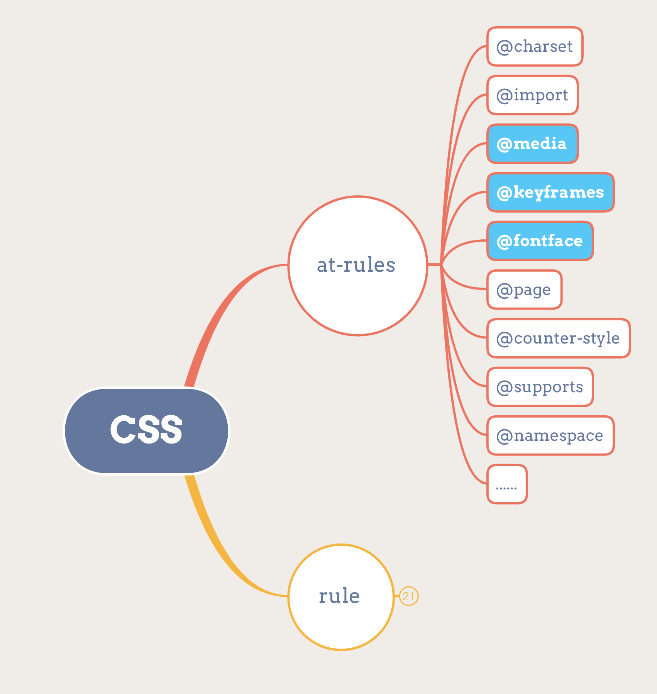

# 学习笔记

根据CSS 2.1规则：https://www.w3.org/TR/CSS21/grammar.html

```
stylesheet
  : [ CHARSET_SYM STRING ';' ]?
    [S|CDO|CDC]* [ import [ CDO S* | CDC S* ]* ]*
    [ [ ruleset | media | page ] [ CDO S* | CDC S* ]* ]*
  ;
// Notation
*: 0 or more
+: 1 or more
?: 0 or 1
|: separates alternatives
[ ]: grouping
```

即一个CSS样式表由@charset, @import和若干rules组成；其中rules可以由@media, @page和普通rule组成。



更多关于@rule的介绍：https://time.geekbang.org/column/article/80042

CSS变量使用方式：--开头定义变量；var()使用变量；

```css
:root {
  --main-color: #06c;
  --accent-color: #006;
}
/* The rest of the CSS file */
#foo h1 {
  color: var(--main-color);
}
```

选择器定义：https://www.w3.org/TR/selectors-4/#syntax


## 思考题：

为什么 first-letter 可以设置 float 之类的，而 first-line 不行呢？

答：first-letter涉及的元素较少，添加float后重排效率高。

```javascript
function match(selector, element) {
    if(!selector||!element.attributes){return false;}
    let compoundSelectors = selector.split(" ").reverse();
    let simpleSelectors = compoundSelectors[0].match(/[#|.]?[A-Z|a-z]+/g);
    let flag = true;
    for (let value of simpleSelectors){
        if(value[0]==="#") {
            if (element.id !== value.slice(1)){
                flag = false;
                break;
            }
        } else if (value[0]==="."){
            if (!element.classList.contains(value.slice(1))){
                flag = false;
                break;
            }
        } else {
            if (element.tagName.toLowerCase() !== value.toLowerCase()){
                flag = false;
                break;
            }
        }
    }
    if (flag === true) {
        if (compoundSelectors.length > 1) {
        	return match(compoundSelectors.slice(1).reverse().join(" "), element.parentElement)
    	} else {
            return true;
        }
    } else {
        return match(compoundSelectors.reverse().join(" "), element.parentElement)
    }
}
 
 
match("div #id.class", document.getElementById("id"));
```

